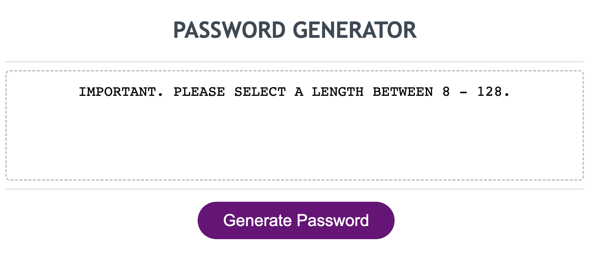

# Password Generator.

## Description.
* Simple, easy to use [Password Generator](https://junel-balbin.github.io/Password-Generator/).

* For this challenge assignment.  I found it difficult to know where to start but in the process, I learned a lot but still need to study more to be confident in my abilities.

* As a beginner to JavaScript.  I am unsure of how everything works but I am sure that I will learn more with time and practice.

## Installation.
* On a web browser please follow the link to begin exploring. [Password Generator](https://junel-balbin.github.io/Password-Generator/).

* Accessible on any mobile device and tablet.

## Usage.
* Click or Press Generate Password to start.

* Selecting Cancel = NO.  Selecting OK = YES.

* Selecting a number below length of 8 or numbers over 128 will give you a message.  Inputting a letter instead of a number will also give a message. "IMPORTANT.  PLEASE SELECT A LENGTH BETWEEN 8 - 128."

*  Selecting no character types will give you a message.
"IMPORTANT.  PLEASE SELECT AT LEAST ONE CHARACTER TYPE."

## Credits & Resources.
* Idea snippets and notes from EdX and UCB.

* Google search.  Stack Overflow search.  Youtube videos.

* Rock, Paper, Scissor mini project was a big help and a great resource for applying the same principles and structure on building the generator.

## Contributing.
* Any ideas or feedback is very much appreciated.

## License.
* MIT License.